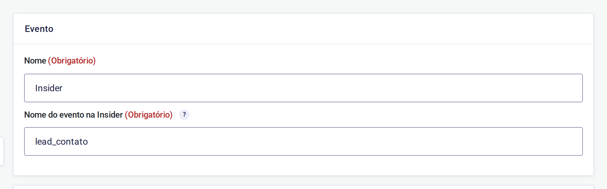
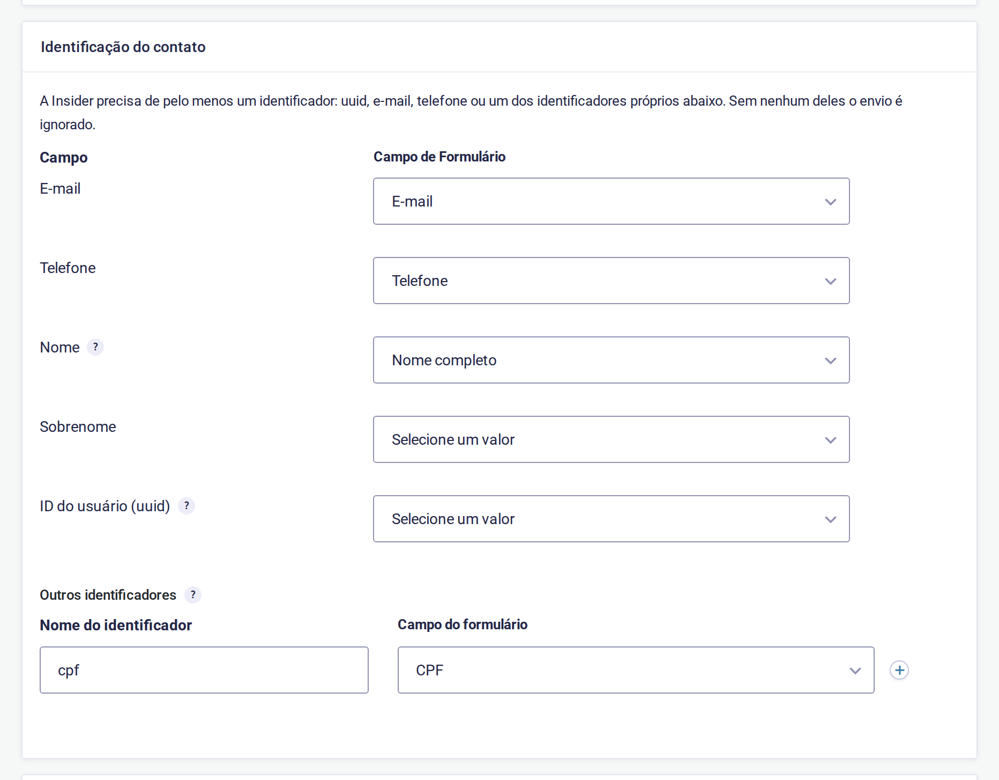
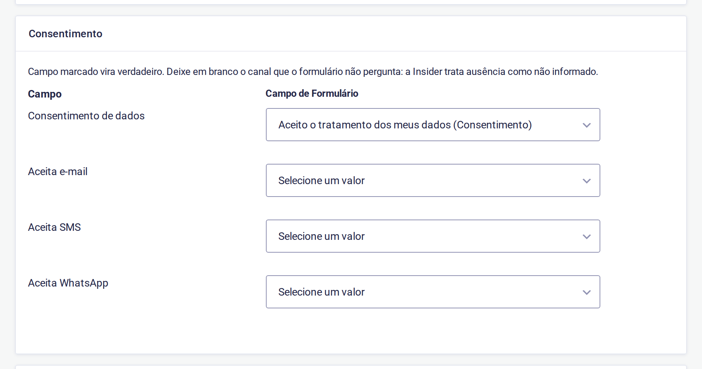
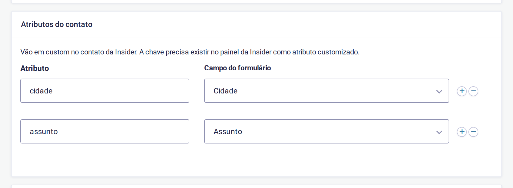

# Insider for Gravity Forms

Add-on que entrega os envios do Gravity Forms à [Insider](https://useinsider.com)
e publica a tag do SDK no site. Cada formulário ganha um *feed* onde você escolhe,
**pelo painel**, qual campo vira o e-mail, o telefone, o nome e o identificador do
contato, quais campos viram atributos e quais viram parâmetros do evento.

## Como funciona

O envio acontece no **navegador de quem preencheu**, pela `window.InsiderQueue`,
e não por chamada de API do servidor. A diferença importa:

- O lead fica ligado à sessão que a Insider já reconhece, então a pessoa é a mesma
  que navegou, viu as campanhas e pode receber web push. Um `upsert` server-side
  cria o contato sem essa ligação.
- Os **valores vêm do servidor**, montados a partir do registro salvo. Um formulário
  de várias etapas envia todos os campos, e não só os da última tela — que é o que
  aconteceria lendo o DOM no submit.

Na prática, o plugin anexa à confirmação do formulário um bloco como este:

```js
window.InsiderQueue.push({ type: 'user', value: {
  email: 'maria@exemplo.com.br',
  phone_number: '+5531988887777',
  name: 'Maria', surname: 'da Silva',
  custom_identifiers: { cpf: '52998224725' },
  gdpr_optin: true,
  custom: { cidade: 'Belo Horizonte', valor_emprestimo: 15000 }
}});
window.InsiderQueue.push({ type: 'custom_event', value: [{
  event_name: 'lead_contato',
  event_parameters: { custom: { form_name: 'Contato' } }
}]});
```

## Requisitos

- WordPress 5.9+, PHP 7.4+
- Gravity Forms 2.5+
- Uma conta Insider, com o **domínio do site liberado** (sem isso o SDK carrega mas
  não envia nada)

## Instalação

Baixe o `.zip` da [última release](https://github.com/jeffersonrucu/wp-gf-insider/releases)
e instale por **Plugins › Adicionar novo › Enviar plugin**.

Em projetos com Composer:

```json
{
  "type": "package",
  "package": {
    "name": "plugins/gf-insider",
    "type": "wordpress-plugin",
    "version": "1.0.0",
    "dist": {
      "url": "https://github.com/jeffersonrucu/wp-gf-insider/releases/download/v1.0.0/gf-insider-1.0.0.zip",
      "type": "zip"
    }
  }
}
```

## Configuração

### 1. A conta

**Formulários › Configurações › Insider.** Os dois valores saem da tag que a Insider
fornece — em `https://{nome}.api.useinsider.com/ins.js?id={id}`, o `{nome}` é o nome
do parceiro e o `{id}` é o ID.


Com **Tag da Insider** ligada, o plugin publica no `<head>` de todas as páginas:

```html
<script>window.InsiderQueue = window.InsiderQueue || [];</script>
<script async src="https://suaempresa.api.useinsider.com/ins.js?id=10000000"></script>
```

A fila é declarada **antes** da tag porque o SDK lê o que já está nela ao carregar.
Desligue o toggle se a tag já entra por um gerenciador de tags.

### 2. O feed do formulário

**Formulários › [o formulário] › Configurações › Insider › Adicionar novo.**

#### Evento



O **nome do evento** precisa ser igual ao que está cadastrado no painel da Insider.
Use um evento por tipo de formulário (`lead_contato`, `lead_orcamento`) quando quiser
segmentar cada um separadamente, ou um só para todos com o formulário indo em um
parâmetro.

#### Identificação do contato



A Insider precisa de **pelo menos um identificador**: `uuid`, e-mail, telefone ou um
identificador próprio. Sem nenhum, o envio é ignorado e só o evento é disparado.

| Campo | Para que serve |
| --- | --- |
| **E-mail**, **Telefone** | Identificadores padrão. O telefone é convertido para E.164 (`(31) 9 8888-7777` → `+5531988887777`) |
| **Nome** | Um campo de nome completo também preenche o sobrenome, quebrando no primeiro espaço |
| **Sobrenome** | Só se o formulário perguntar separado; mapeado aqui, o nome não é quebrado |
| **ID do usuário (uuid)** | O identificador principal da Insider: o id que a pessoa já tem no seu sistema. Deixe vazio se o formulário não souber esse id |
| **Outros identificadores** | Identificador adicional com nome próprio, como o CPF. Chega na Insider como `c_cpf` |

> **Não use o `uuid` para o CPF.** Se o seu back-end envia `uuid` com o id interno e o
> site envia `uuid` com o CPF, a Insider guarda duas pessoas diferentes. O CPF vai em
> *Outros identificadores*, e o plugin remove a pontuação antes de enviar — é assim
> que um back-end costuma gravar, e um ponto de diferença já cria um segundo perfil.

#### Consentimento



Campo marcado vira `true`. **Deixe em branco o canal que o formulário não pergunta:**
um aceite de tratamento de dados não é opt-in de marketing, e a Insider trata a
ausência como "não informado".

#### Atributos e parâmetros



- **Atributos do contato** → `custom` do contato. A chave precisa existir no painel
  da Insider como atributo customizado.
- **Parâmetros do evento** → `event_parameters.custom`. Aceita campo do formulário ou
  valor fixo, útil para carimbar a origem.

Valores numéricos são enviados como número (`15000`, não `"15000"`), senão a Insider
não consegue segmentar por faixa. Um zero à esquerda marca código, não quantidade:
`01310` continua texto.

#### Condição

Serve para enviar só quando o registro atender a uma regra — por exemplo, mandar
apenas quem marcou um determinado assunto.

### 3. Antes de ir ao ar

No painel da Insider:

1. **Libere o domínio do site** na conta.
2. **Attributes › Create**: cada chave usada em *Atributos do contato*, com o Data Type
   certo (Number para valor e quantidade, String para o resto).
3. **Events › Create**: cada nome de evento usado nos feeds, com seus parâmetros.

Atributo ou evento que não existe no painel é descartado na chegada.

## Como validar

1. Instale a extensão [Insider Hits](https://chromewebstore.google.com/detail/insider-hits/dgfcbjjhlabibmpjlpdmlommhcpklkib):
   ela abre uma aba no DevTools com cada hit enviado, já separado por evento.
2. Abra qualquer página e confirme que o page view sai — é o que prova que o domínio
   está liberado.
3. Preencha o formulário. Devem sair dois hits: o contato e o evento.
4. No painel: procure o contato em **User Profiles** e o evento em **Event History**.

Para ver o que sai sem depender da resposta da Insider, cole no console **antes** de
enviar o formulário:

```js
(() => { const p = window.InsiderQueue.push.bind(window.InsiderQueue);
  window.InsiderQueue.push = (...a) => { console.log('InsiderQueue →', ...a); return p(...a); }; })()
```

## Detalhes que evitam dor de cabeça

- **Cache e delay de JS.** O plugin já se exclui do WP Rocket e do Perfmatters. Sem
  isso o Rocket atrasa a tag até a primeira interação **e** minifica o `ins.js` numa
  cópia local, que congela o SDK na versão em cache.
- **Confirmação por redirecionamento.** O push viaja na confirmação do formulário; um
  formulário configurado para redirecionar não tem onde carregá-lo. Use confirmação de
  texto nos formulários que alimentam a Insider.
- **Sem identificador, sem contato.** Um formulário que só pede assunto e mensagem
  dispara o evento, mas não cria contato.

## Desenvolvimento

As regras de conversão (E.164, nome/sobrenome, consentimento, tipo e identificador)
ficam em `includes/class-gf-insider-payload.php`, sem dependência do WordPress, e têm
verificação própria:

```sh
php tests/test-payload.php
```

## Licença

GPL-2.0-or-later.
