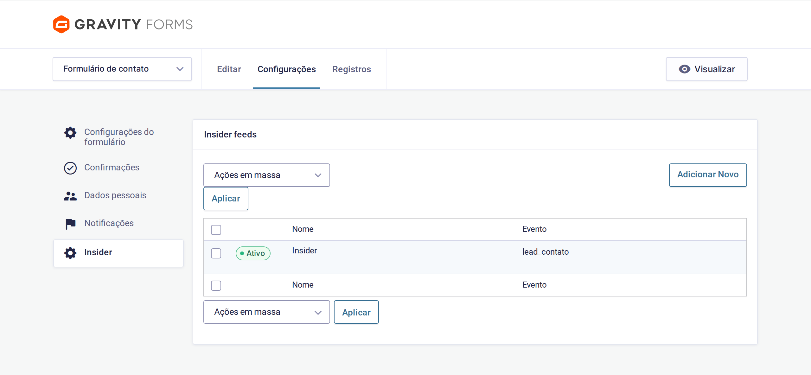
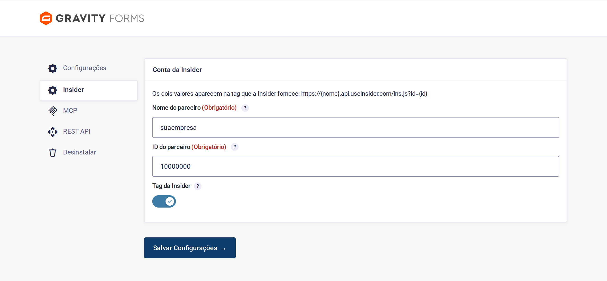
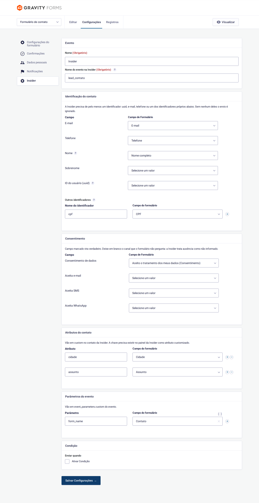

# Insider for Gravity Forms

Sends Gravity Forms submissions to [Insider](https://useinsider.com) and prints the
Insider tag. One feed per form, mapped in the admin — no code.



## How it works

On submission the plugin posts the entry to Insider's
upsert API **from the server**,
in the same shape a back end uses, so the site and the back end merge into one profile:

```json
{
  "users": [{
    "identifiers": { "cpf": "00000000000" },
    "attributes": {
      "name": "Fulano", "surname": "de Tal",
      "phone_number": "+5511900000000", "gdpr_optin": true
    },
    "events": [{
      "event_name": "lead_simulador",
      "timestamp": "2026-01-20T20:50:00.000Z",
      "event_params": { "custom": { "valor_emprestimo": 5000, "numero_parcelas": 12 } }
    }]
  }]
}
```

The values come from the saved entry, so a multi-page form sends every field, and a
redirect confirmation or an ad blocker does not stop the send. A failed send is written
as a note on the entry.

## Requirements

WordPress 5.9+ · PHP 7.4+ · Gravity Forms 2.5+ · an Insider account and an **Upsert API key**.

## Install

Download the `.zip` from the [latest release](https://github.com/jeffersonrucu/wp-gf-insider/releases)
and install it under **Plugins › Add New › Upload Plugin**.

<details>
<summary>Composer</summary>

```json
{
  "type": "package",
  "package": {
    "name": "plugins/gf-insider",
    "type": "wordpress-plugin",
    "version": "1.1.3",
    "dist": {
      "url": "https://github.com/jeffersonrucu/wp-gf-insider/releases/download/v1.1.3/gf-insider-1.1.3.zip",
      "type": "zip"
    }
  }
}
```
</details>

## Setup

### 1. Account

**Forms › Settings › Insider.** Partner name and id come from the tag Insider gives you —
in `https://{name}.api.useinsider.com/ins.js?id={id}`. The **API key** is generated in the
Insider panel under **Integration Settings › API Keys**, with the **Upsert** type; the name
is also the `X-PARTNER-NAME` header of every send.
If the key has an IP allowlist, add the server's **IPv4** address: the plugin always
sends over IPv4, because the allowlist does not take IPv6.



With the toggle on, the plugin prints this in `<head>` on every page:

```html
<script>window.InsiderQueue = window.InsiderQueue || [];</script>
<script async src="https://yourcompany.api.useinsider.com/ins.js?id=10000000"></script>
```

The tag only tracks browsing; the form data does not depend on it. Turn the toggle off
if a tag manager already injects the tag.

### 2. Feed

**Forms › [your form] › Settings › Insider › Add New.**



The **event name** must match the one registered in your Insider panel.

Insider needs **at least one identifier**. Without any, nothing is sent.

| Field | Notes |
| --- | --- |
| **Email**, **Phone** | Sent as attributes. Without a uuid or other identifier, the email identifies the contact, and without an email, the phone. Phone is converted to E.164 (`(11) 90000-0000` → `+5511900000000`) |
| **Name** | First name only: a full-name field also fills the surname, splitting at the first space |
| **Surname** | Map it only if the form asks separately |
| **User ID (uuid)** | Insider's main identifier: the id the person already has in your system. Leave empty if the form does not know it |
| **Other identifiers** | An extra identifier with its own name, such as a national ID. Sent inside `identifiers` |

> **Do not put a document number in `uuid`.** If your back end sends `uuid` with an
> internal id and the site sends `uuid` with a document, Insider keeps two people. Use
> *Other identifiers* — the plugin strips punctuation before sending, which is how a
> back end usually stores it.

A checked consent field becomes `true`. **Leave blank any channel the form does not ask about:**
a data-processing consent is not a marketing opt-in, and Insider treats absence as
"unknown".

- **Event parameters** → `events[].event_params.custom`, accepting a form field or a fixed value

Numbers are sent as numbers (`15000`, not `"15000"`) so Insider can segment by range.
A leading zero means a code, not a quantity: `01310` stays text.

Use **Condition** to send only entries matching a rule.

### 3. In the Insider panel

1. **Integration Settings › API Keys** — generate the Upsert key.
2. **Events › Create** — every event name used in your feeds, with its parameters and the
   right data type (Number for amounts and counts, String otherwise).
3. If the document is the identifier, register it as a **custom identifier** (`cpf`).

An event or parameter that does not exist in the panel is dropped on arrival.

## Testing

1. Enable logging under **Forms › Settings › Logging** and submit the form.
2. A failed send leaves a note on the entry with the status and Insider's answer; a
   successful one logs `Insider answered 200`.
3. In the panel, find the contact under **User Profiles** and the event under
   **Event History**.

## Gotchas

- **Caching plugins.** The plugin already excludes the tag from WP Rocket and
  Perfmatters. Otherwise Rocket delays the tag until first interaction **and** minifies
  `ins.js` into a local copy, freezing the SDK at the cached version.
- **The send is synchronous.** It adds Insider's response time, capped at 10 s, to the
  form submission.
- **No identifier, no contact.** A form asking only for a subject and a message sends nothing.

## Development

The conversion rules — E.164, name splitting, consent, typing, identifiers — live in
`includes/class-gf-insider-payload.php` with no WordPress dependency, and have their
own check:

```sh
php tests/test-payload.php
```

## License

GPL-2.0-or-later
